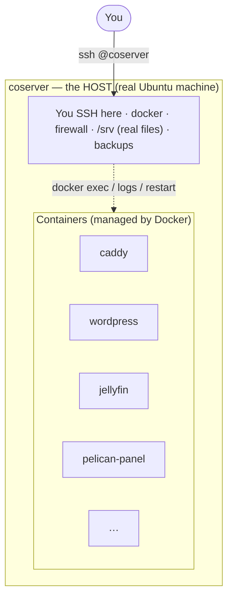

# Day-to-Day Container Management

A practical tutorial for running the containers on `coserver`. It assumes you've
used a Linux shell a little (you can `cd`, `ls`, and run a command) but are not a
container expert. For the big-picture tour of what each app is, see the
[Server Owner's Guide](Server-Guide.md); this document is about the hands-on
mechanics of working with the containers themselves.

Almost everything here can be done two ways: from the **host shell** (typing
`docker` commands after you SSH in) or from **Portainer** (a web UI). Both are
shown. Pick whichever you're comfortable with.

---

## 1. The host vs. the containers — the one idea to understand first

Your server is **one** Ubuntu machine — that's the **host**. When you SSH in as
`<user>@coserver`, you are on the host. The host has the real disks, the firewall,
SSH, `docker`, and the `/srv` folder.

Each application runs inside its own **container**: a sealed, minimal mini-Linux
that holds just that one app and the libraries it needs. The containers all run
*on* the host, but they are walled off from each other and from the host.



Key consequences of this separation — keep these in mind and most confusion
disappears:

- **Different filesystems.** A file you see inside a container is *not* the same
  as a file on the host, unless it's on a shared "volume" (more in §7). The
  host's `/etc` and a container's `/etc` are unrelated.
- **Different software.** The host is a full Ubuntu with `apt`, `bash`, `sudo`,
  `systemctl`. A container usually has almost none of that — often not even
  `bash` (see §6).
- **Different users.** On the host you're `<user>`. Inside a container you're
  whatever user that image uses — often `root`, but sometimes `www-data`,
  `node`, etc. "root inside a container" is not the same as root on the host.
- **Containers are disposable.** The host is permanent. A container can be
  destroyed and recreated from its image at any time (an update does exactly
  this). Anything written *inside* a container — but not on a mounted volume —
  is lost when that happens (§6, §7).

---

## 2. Seeing what's running

From the host shell:

```bash
ssh <user>@coserver.chemicaloutlaws.com      # get onto the host first

sudo docker ps                  # list running containers
sudo docker ps -a               # include stopped ones
sudo docker stats --no-stream   # one-shot CPU/memory per container
```

`docker ps` shows each container's **name** (e.g. `wordpress`, `jellyfin`) —
that name is what you use in every other command below.

In **Portainer** (`https://portainer.chemicaloutlaws.com`, reachable from your
LAN/VPN): open **Containers** in the left menu for the same list, with green/red
status dots and buttons for logs, console, restart, etc.

The containers currently on this server:

| Container | App it runs | Container | App it runs |
|---|---|---|---|
| `caddy` | Web front door (HTTPS) | `healthchecks` | Backup/cron monitoring |
| `wordpress` / `wordpress-db` | WordPress + its database | `portainer` | This management UI |
| `jellyfin` | Media streaming | `pelican-panel` | Game-server panel (Pelican) |
| `dashy` | Dashboard | `bracket` / `bracket-db` | Tournaments + its database |
| `glance` | Dashboard | | |

The `-db` and `-database` containers are *helpers* for the app next to them —
you rarely touch them directly. This server runs the **Pelican** game panel,
which is a single container (`pelican-panel`, SQLite) with no separate database
or cache. If you switch to Pterodactyl instead you'd see `pterodactyl-panel`
plus its `pterodactyl-database` / `pterodactyl-cache` helpers.

If the optional game-server **database host** is deployed (a host in the `mysql`
inventory group), you'll also see two more containers:

| Container | App it runs |
|---|---|
| `mysql` | MariaDB database server — the panel's "Database Host" for game servers |
| `mysql-adminer` | Adminer — web UI to browse/edit those databases |

Unlike the per-app `-db` helpers above, `mysql` is a *shared* database the panel
uses to hand each game server its own database. Its passwords live in
`/srv/mysql/secrets/`.

---

## 3. The four everyday commands

These cover ~90% of day-to-day work. Each is shown for the host shell and for
Portainer.

### View a container's logs (the #1 troubleshooting tool)
```bash
sudo docker logs wordpress           # recent logs
sudo docker logs -f wordpress        # follow live (Ctrl-C to stop)
sudo docker logs --tail 100 caddy    # last 100 lines
```
*Portainer:* Containers → click the container → **Logs**.

### Restart a container
```bash
sudo docker restart jellyfin
```
*Portainer:* Containers → tick the box → **Restart**. Safe and quick; the app is
unavailable for a few seconds.

### Stop / start a container
```bash
sudo docker stop dashy
sudo docker start dashy
```
*Portainer:* the **Stop** / **Start** buttons.

### Check status / resource use
```bash
sudo docker ps                       # is it up?
sudo docker stats --no-stream        # CPU + memory snapshot
```
*Portainer:* the **Containers** list shows state; click one for **Stats**.

> **Restart vs. stop vs. "down":** `restart`/`stop`/`start` act on a single
> container and keep it around. Re-creating a whole app (all its containers) is a
> different operation done from its `/srv/<app>` folder with `docker compose` —
> see §7. You won't need that for routine work.

---

## 4. Getting a shell *inside* a container

Sometimes you need to poke around inside a container — check a file, run the
app's own command-line tool, test connectivity. This is called "exec-ing in".

### From the host shell

The pattern is `docker exec -it <container> <shell>`. Most images have `sh`;
some also have `bash`. Try `bash`, and fall back to `sh`:

```bash
sudo docker exec -it wordpress bash      # works on wordpress, jellyfin, etc.
sudo docker exec -it caddy sh            # caddy only has sh
```

- `-it` means "interactive terminal" — without it you won't get a prompt.
- You'll get a shell *inside* the container. Type `exit` to return to the host.
- The prompt and available commands change because you're now in a different
  mini-OS.

**One-liners without a full shell** — to run a single command and come straight
back, skip the `-it` and put the command at the end:

```bash
sudo docker exec wordpress php -v                       # check PHP version
sudo docker exec pelican-panel php artisan about        # Pelican/Laravel info
sudo docker exec wordpress-db mariadb --version
```

**Need to be root inside?** Some containers run as a non-root user (e.g.
`pelican-panel` runs as `www-data`, `dashy` as `node`). If you need root *inside
that container* to inspect something, add `-u root`:

```bash
sudo docker exec -it -u root pelican-panel sh
```

### From Portainer (no typing of `docker`)

1. **Containers** → click the container.
2. Click **Console** (or the **>_** icon).
3. For "Command" choose `/bin/bash` if offered, otherwise `/bin/sh`. Leave the
   user as default, or set `root` if you need it.
4. Click **Connect**. You get the same in-container shell in your browser.
   Close the tab or type `exit` when done.

> Tip: if `/bin/bash` gives an error like "no such file", reconnect with
> `/bin/sh` — that container simply doesn't include bash (§6).

---

## 5. Connecting to an app's *own* console (not a Linux shell)

"Console" can mean two different things — don't mix them up:

- **A Linux shell inside the container** — §4 above (for files, tools, debugging).
- **An application's own interactive console** — e.g. a game server's command
  console in Pterodactyl/Pelican, or a database prompt.

For **game servers**, you do *not* exec into a container. You use the **panel's
web UI** (`panel.chemicaloutlaws.com`): open the server → **Console** tab. The
panel talks to the game-server containers for you. That's the supported way;
exec-ing into game containers by hand can fight with the panel.

For a **database prompt**, exec into the DB container and run its client:
```bash
sudo docker exec -it wordpress-db mariadb -u root -p     # it will ask for the password
# password is in /srv/wordpress/secrets/db_root_password on the host

# If the optional game-server database host is deployed:
sudo docker exec -it mysql mariadb -u root -p            # password in /srv/mysql/secrets/root_password
```
For the game-server database host you'd usually use the **Adminer** web UI
(`mysql-adminer`, fronted by Caddy) instead of the command line.

---

## 6. Limitations: what you *can't* (easily) do inside a container

This is where people new to containers get tripped up. Containers are
intentionally minimal, so normal "admin reflexes" often don't work inside them.

**1. There's often no `bash`, no `apt`, no `sudo`, no `systemctl`.**
Container images ship only what the app needs. On this server:

| Has `bash` | Only `sh` (no bash) | No shell at all |
|---|---|---|
| `wordpress`, `wordpress-db`, `jellyfin`, `healthchecks`, `bracket-db` | `caddy`, `dashy`, `glance`, `bracket`, `pelican-panel` | `portainer` |

So `apt install …` inside a container will usually fail (`apt: not found`), and
there is no `systemctl` because a container runs **one** process, not a full init
system. **Portainer has no shell at all** — you manage it only through its web UI.

**2. Anything you install or edit inside a container is temporary.**
If you *do* manage to install a tool or edit a config *inside* a running
container, it lives only until that container is recreated — which happens on the
next update or `docker compose up`. The container is rebuilt from its fixed image
and your change vanishes. **This is by design.** Lasting changes are made on the
host instead (§7).

**3. "root inside the container" ≠ root on the host.**
Becoming root in a container (`-u root`) lets you edit that container's files for
the moment, but it does not give you any power over the host, and the change is
still temporary (point 2).

**4. You're whoever the image runs as.**
Files inside are owned by the container's user. If you exec in as the default
user and get "permission denied", that's why — reconnect with `-u root`.

**5. Containers are isolated from each other.**
From inside `wordpress` you can't see `jellyfin`'s files or processes. They reach
each other only over the shared network, by container name (e.g. WordPress
reaches its database at the host name `wordpress-db`).

**Rule of thumb:** use an in-container shell for *looking* (read a file, check a
version, tail a log, run the app's own CLI). For *changing* things that should
stick, work on the host (§7).

---

## 7. Making changes that last: edit on the host, recreate the container

Each app's real, persistent files live on the **host** under `/srv/<app>` and are
mounted into the container. Editing them on the host is how you make permanent
changes — and it's also what the nightly backup protects.

Typical loop:

```bash
# 1. Edit the app's config on the HOST (not inside the container)
sudo nano /srv/dashy/user-data/conf.yml

# 2. Apply it by recreating that app's containers from its folder
cd /srv/dashy
sudo docker compose up -d        # picks up changes; recreates only what changed
```

Other useful whole-app commands from inside an app's `/srv/<app>` folder:

```bash
sudo docker compose ps           # status of just this app's containers
sudo docker compose logs -f      # logs for the whole app (all its containers)
sudo docker compose pull         # download newer image versions
sudo docker compose up -d        # recreate with the new images (an update)
sudo docker compose down         # stop & remove this app's containers (data on /srv stays)
```

Because the data is on `/srv`, `down` then `up -d` does **not** lose your data —
only the container processes are replaced; the files on the host remain.

> The Ansible playbook is the "official" way to make these changes repeatably
> (see the Server Guide). The manual commands here are perfect for quick tweaks
> and learning, but if you also run the playbook, keep the two in sync.

---

## 8. FAQ

**Q: I edited a file inside a container and after an update it's gone. Why?**
Because in-container changes are temporary (§6.2). Edit the copy under
`/srv/<app>` on the host instead, then `docker compose up -d` (§7).

**Q: `docker exec -it caddy bash` says "no such file or directory".**
That image has no `bash`. Use `sh`: `sudo docker exec -it caddy sh`.

**Q: I get "permission denied" inside a container.**
You're not root in that container. Reconnect with `-u root`:
`sudo docker exec -it -u root <name> sh`.

**Q: How do I update an app to the latest version?**
`cd /srv/<app> && sudo docker compose pull && sudo docker compose up -d`. In
Portainer you can also recreate a container and tick "re-pull image".

**Q: A container keeps restarting / shows "unhealthy".**
Read its logs first: `sudo docker logs --tail 100 <name>`. The reason is almost
always in there (bad config, can't reach its database, permissions).

**Q: Which container is which app?** See the table in §2, or
`sudo docker ps` and read the names.

**Q: Will restarting a container lose data?**
No. `restart`/`stop`/`start`, and even `down`+`up`, keep everything under
`/srv/<app>`. Only data written *inside* a container off-volume is transient.

**Q: How do I see how much CPU/RAM things use?**
`sudo docker stats --no-stream`, or Portainer's **Stats** per container, or the
[Cockpit](Server-Guide.md) dashboard for the whole machine.

**Q: Do I need `sudo` for every `docker` command?**
On this server, yes — the containers run under the system (rootful) Docker and
`<user>` is not in the `docker` group, so `docker` commands need `sudo`. Inside
Portainer you're already authenticated.

**Q: Is it safe to `docker stop` an app to "reboot" it?**
Yes. `stop` then `start` (or just `restart`) is safe. Avoid `docker rm` /
`docker rmi` / `docker volume rm` unless you know what they do — those delete
containers/images/volumes.

**Q: I'm lost inside a container shell — how do I get out?**
Type `exit` (or press `Ctrl-D`). You'll be back on the host prompt.

---

## 9. Quick reference card

```text
ON THE HOST (after: ssh <user>@coserver.chemicaloutlaws.com)

  sudo docker ps                      list running containers
  sudo docker logs -f NAME            follow a container's logs
  sudo docker restart NAME            restart one container
  sudo docker stop|start NAME         stop / start one container
  sudo docker stats --no-stream       CPU & memory snapshot
  sudo docker exec -it NAME bash      shell inside (try bash, else sh)
  sudo docker exec -it -u root NAME sh  root shell inside
  sudo docker exec NAME <cmd>         run one command inside

PER APP (after: cd /srv/<app>)

  sudo docker compose ps              this app's containers
  sudo docker compose logs -f         this app's logs
  sudo docker compose up -d           apply config / recreate
  sudo docker compose pull            fetch newer images
  sudo docker compose down            stop+remove (data on /srv stays)

REMEMBER
  • Edit lasting changes on the HOST under /srv/<app>, not inside the container.
  • Some containers have only sh; portainer has no shell — use its web UI.
  • restart/stop/down never delete /srv data; rm/rmi/volume rm do delete things.
```
