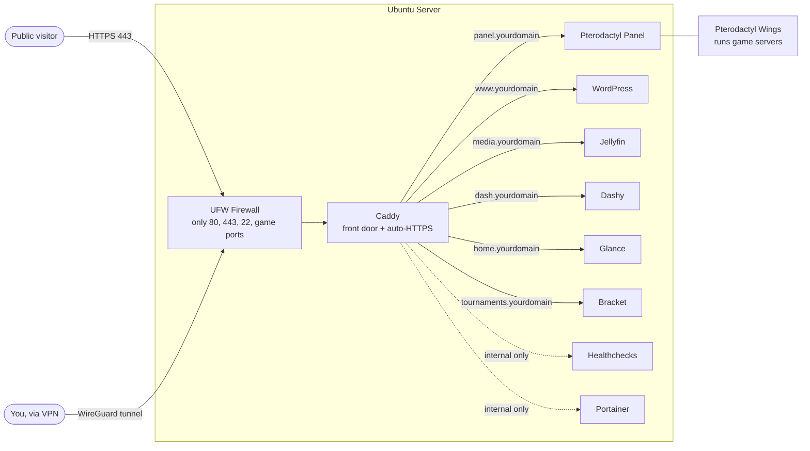
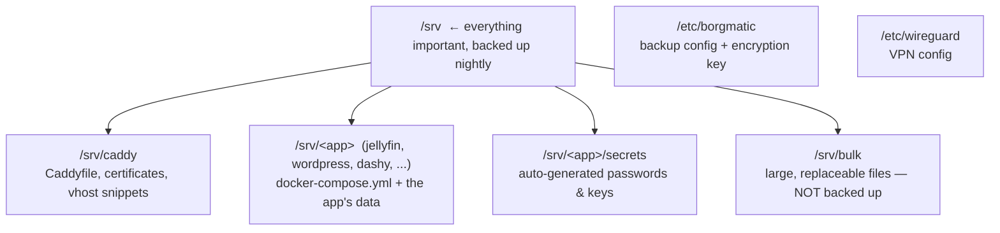

# Your Server: Owner's Operating Guide

This guide makes you the operator of your own server. It explains what is
running, how it fits together, how to run it day to day, and — if you ever stop
using the automation — how to manage everything by hand. You do not need anyone
else to keep this server running.

Two ways to manage this server are described throughout:

- **The automated way** — re-run the Ansible "recipe". Best when you want a
  change made consistently and recorded.
- **The manual way** — type commands directly on the server. Best for quick
  fixes, learning how things work, or if you decide to retire the automation
  entirely (see Section 11).

Both are first-class. The automation only *built* the server; nothing depends on
it to keep *running*. Everything uses standard Ubuntu tools (Podman, systemd,
UFW, borgmatic) that you can drive yourself.

---

## 1. The short version

Your server is one Ubuntu machine running several self-contained web
applications. Each app runs in its own **container** (an isolated box holding
just that app and its dependencies). A single web "front door" called **Caddy**
receives all web traffic, automatically obtains and renews HTTPS certificates,
and forwards each web address to the correct app.

The server also backs itself up offsite every night, watches itself for
failures, patches itself, and is firewalled against the internet.

All your data lives in one place: **`/srv`**. Back that up and you've backed up
everything.

---

## 2. How it all fits together

### Traffic flow



Everything inside the dotted **internal only** lines is reachable from your
private network (over the WireGuard VPN) but invisible to the public internet.
All containers talk to each other on a private Podman network called `web`.

### Where things live on disk



---

## 3. What is running (the full inventory)

### Apps you and your users visit

| Application | Purpose | Web address (you choose) | Data folder |
|---|---|---|---|
| **Pterodactyl Panel** | Control panel for game servers (Minecraft, etc.) | `panel.yourdomain` | `/srv/pterodactyl` |
| **Pterodactyl Wings** | The engine that actually runs game servers (managed from the Panel) | — (no web page) | `/etc/pterodactyl`, `/var/lib/pterodactyl` |
| **WordPress** | Website / blog | `www.yourdomain` | `/srv/wordpress` |
| **Jellyfin** | Private media streaming (movies, TV, music) | `media.yourdomain` | `/srv/jellyfin` |
| **Dashy** | Customisable links/tiles dashboard | `dash.yourdomain` | `/srv/dashy` |
| **Glance** | Lightweight info dashboard (feeds, widgets) | `home.yourdomain` | `/srv/glance` |
| **Bracket** | Tournament-bracket system | `tournaments.yourdomain` | `/srv/bracket` |

### Behind-the-scenes services

| Component | Purpose | How to reach it |
|---|---|---|
| **Caddy** | Web front door; auto-HTTPS; routes addresses to apps | `/srv/caddy` |
| **Healthchecks** | Alerts you when a scheduled job (e.g. backup) fails to check in | `healthchecks.yourdomain` (internal only) |
| **Borg / Borgmatic** | Encrypted nightly offsite backup of `/srv` | runs from a systemd timer |
| **Cockpit** | Web dashboard for the **machine** (CPU, RAM, disks, logs, updates) | `https://your-server:9090` |
| **Portainer** | Web dashboard for the **containers** (restart, logs, terminal) | `portainer.yourdomain` (internal only) |
| **Hardening** | Firewall, intrusion blocking, SSH lock-down, auto security patches | system-wide |
| **WireGuard** | Encrypted VPN tunnel to your private network/gateway | `/etc/wireguard/wg0.conf` |

> The folders `disk_os`, `disk_pool`, `disk_stripe`, and `run` in the project are
> empty placeholders that set up nothing. Ignore them.

---

## 4. Five concepts that explain everything

**1. Containers (Podman).** Every app runs in its own Podman container. Each
app's container is defined by a `docker-compose.yml` file in its `/srv/<app>`
folder. You start, stop, update, and inspect apps with `podman` and
`podman-compose` commands — covered in Section 6.

**2. Caddy, the front door.** Only Caddy is exposed to the web (ports 80/443).
It reads `/srv/caddy/Caddyfile`, which lists every web address and which app it
points to, and it gets HTTPS certificates automatically. Nothing to renew by
hand.

**3. `/srv` is your data.** Configuration, databases, and content all live under
`/srv/<app>`. This is exactly what the nightly backup protects. `/srv/bulk` is
deliberately excluded (meant for large, replaceable files).

**4. Secrets are generated and saved for you.** On first install, each app's
database passwords and keys are generated and written to `/srv/<app>/secrets/`.
You can read them there with `sudo cat`. Secrets you provide (like the backup
passphrase) are stored encrypted in the project with **Ansible Vault**.

**5. Everything runs on standard Ubuntu services.** Containers are kept alive by
Podman (`restart: always`), backups by a systemd timer, the firewall by UFW.
None of this needs Ansible once it's set up — so you can run the server
indefinitely by hand if you choose (Section 11).

---

## 5. Getting in: the management dashboards

You rarely need the command line. Two web dashboards cover most tasks:

- **Cockpit — the machine.** Open `https://your-server-address:9090`, sign in
  with your normal server login. See disk space, memory, running services,
  system logs, and apply OS updates with a click. It also has a built-in
  **Terminal** and **File browser** if you want them.

- **Portainer — the apps.** Open the Portainer address (internal-only; connect
  via WireGuard first). On first visit, create the admin account and accept the
  "local" environment. Use it to restart an app, read its logs, open a shell
  inside a container, or check resource usage. Your Ansible-deployed stacks show
  up as **Limited** — that's expected; Portainer can still manage their
  containers.

---

## 6. Day-to-day app management (the manual way)

Every app is a `podman-compose` stack living in `/srv/<app>`. The same handful
of commands works for all of them. Run them as a user with `sudo`, or as root.

```bash
# Go to the app's folder first
cd /srv/jellyfin            # or wordpress, dashy, glance, bracket, caddy, ...

# See what's running
sudo podman-compose ps

# Start (or re-create after a config change)
sudo podman-compose up -d

# Stop
sudo podman-compose down

# Restart just this app
sudo podman-compose restart

# Watch the logs live (Ctrl-C to stop)
sudo podman-compose logs -f

# Update to the latest version: pull new images, then recreate
sudo podman-compose pull && sudo podman-compose up -d
```

Single-container shortcuts (handy in a pinch):

```bash
sudo podman ps                      # list ALL running containers on the host
sudo podman restart jellyfin        # restart one container by name
sudo podman logs -f wordpress       # tail one container's logs
sudo podman exec -it wordpress bash # open a shell inside a container
```

**Editing an app's configuration.** Edit the files under `/srv/<app>` (for
example `/srv/dashy/user-data/conf.yml` or `/srv/glance/config/glance.yml`),
then `cd` into the folder and run `sudo podman-compose restart`. You can edit
these files directly on the server, through Cockpit's file browser, or over SFTP
if your login is a member of that app's group (e.g. the `dashy` group).

**Finding an app's passwords.** They're saved on the server:

```bash
sudo ls /srv/wordpress/secrets/
sudo cat /srv/wordpress/secrets/db_password
```

---

## 7. The web front door: Caddy

Caddy decides which web address goes to which app, and handles all HTTPS.

**To add or change a website address**, edit `/srv/caddy/Caddyfile`. Each app is
a block like this:

```caddyfile
media.yourdomain {
    encode gzip
    reverse_proxy jellyfin:8096
}
```

To make a site internal-only (reachable only from your VPN/LAN), add
`import internal_only` inside its block.

**After editing the Caddyfile, reload Caddy without downtime:**

```bash
sudo podman exec caddy caddy reload --config /etc/caddy/Caddyfile
```

Caddy fetches a certificate for any new address automatically, as long as:
- a DNS record for that name points at your server's public IP, **and**
- ports 80 and 443 are reachable from the internet.

> The automated way to do the same thing is to add an entry to the `caddy_sites`
> list in the project's `inventory/` and re-run `--tags caddy` (Section 10).

---

## 8. Backups and restore

This is the most important section. Read it once now, not during an emergency.

**What happens automatically:**
- Every night around **03:00**, `borgmatic` makes an encrypted backup of `/srv`
  (excluding `/srv/bulk`) and uploads it to your offsite Hetzner Storage Box.
- It keeps **30 daily, 12 monthly, 10 yearly** snapshots and prunes the rest.
- Each run pings **Healthchecks**, which alerts you if a backup is ever missed.

**The one thing you must protect:** the backup **passphrase** (and the offsite
storage login). If the passphrase is lost, *no one* — including you — can ever
read the backups again. There is no reset. Keep it in a password manager and,
ideally, on paper in a safe, stored separately from the server.

**Driving backups by hand** (config lives at `/etc/borgmatic/config.yaml`):

```bash
# Run a backup right now
sudo borgmatic

# See when the automatic backup last ran / runs next
systemctl list-timers borgmatic.timer

# List all backup snapshots in the repository
sudo borgmatic list

# Show stats about the repository / a snapshot
sudo borgmatic info
```

**Restoring files** (the part that matters):

```bash
# 1. Find the snapshot you want
sudo borgmatic list

# 2. Restore that whole snapshot into the current directory
#    (do this in an empty folder, then copy what you need back into /srv)
sudo borgmatic extract --archive <snapshot-name>

# Example: restore just /srv/wordpress from a snapshot
sudo borgmatic extract --archive <snapshot-name> --path srv/wordpress
```

After restoring an app's folder, `cd /srv/<app>` and run
`sudo podman-compose up -d` to bring it back online.


---

## 9. Security you already have (and how to manage it)

**Firewall (UFW).** Default-deny inbound; only the ports your services need are
open.

```bash
sudo ufw status numbered     # see all rules
sudo ufw allow 8080/tcp      # open a new port
sudo ufw delete <number>     # remove a rule by its number
```

**Intrusion blocking (fail2ban).** Automatically bans IPs that repeatedly fail
SSH logins.

```bash
sudo fail2ban-client status sshd            # see current bans
sudo fail2ban-client set sshd unbanip <IP>  # lift a ban
```

**SSH.** Locked to key-based login (no passwords). Settings live in the drop-in
file `/etc/ssh/sshd_config.d/99-hardening.conf`. After editing it,
`sudo systemctl reload ssh`.

**Automatic security patches** are enabled (unattended-upgrades). You can also
patch on demand:

```bash
sudo apt update && sudo apt upgrade
```

**WireGuard VPN.** Connects this server to your private network so internal-only
tools stay private. Check it with `sudo wg show`; restart with
`sudo systemctl restart wg-quick@wg0`.

---

## 10. The automated way (re-running the recipe)

The whole server is described in the Ansible playbook `site.yml`. Re-running it
is safe — it only changes what no longer matches the description. This is the
tidy way to make a change *and* keep it recorded.

```bash
# Re-apply everything
ansible-navigator run site.yml --eei ee-demo -i inventory/hosts.yml

# Re-apply just one piece (tags):
ansible-navigator run site.yml --tags jellyfin
ansible-navigator run site.yml --tags caddy
ansible-navigator run site.yml --tags borg
ansible-navigator run site.yml --tags hardening
```

Available tags: `update`, `hardening`, `wireguard_client`, `cockpit`, `caddy`,
`pterodactyl`, `wings`, `wordpress`, `dashy`, `glance`, `bracket`, `jellyfin`,
`portainer`, `healthchecks`, `borg`. Add `--skip-tags update` to skip the OS
upgrade.

**Where to change settings:** the `inventory/` folder holds per-server settings
(web addresses, options, and Vault-encrypted secrets). Adding a public address
means adding to the `caddy_sites` list there.

> **Important:** if you make changes *by hand* on the server (Sections 6–9) and
> later re-run a matching playbook tag, the playbook may overwrite your manual
> change to match what's in `inventory/`. Pick one source of truth per app, or
> mirror manual changes back into `inventory/`. If you decide to stop using the
> playbooks entirely, see the next section.

---

## 11. Going fully manual (retiring the automation)

You are not locked in. The server runs entirely on standard Ubuntu components;
Ansible was only the installer. To operate without it forever:

1. **Keep the data and configs in place.** Everything you need already lives on
   the server: app stacks in `/srv/<app>/docker-compose.yml`, the web config in
   `/srv/caddy/Caddyfile`, backups in `/etc/borgmatic/config.yaml`, the VPN in
   `/etc/wireguard/`. Nothing here references Ansible.

2. **Save the secrets out of the project.** Before walking away from the
   playbooks, copy these somewhere safe:
   - the **backup passphrase** (from your Vault / inventory),
   - the **Hetzner Storage Box** login and SSH key (`/etc/borgmatic/`),
   - any app admin passwords you set, plus what's in each
     `/srv/<app>/secrets/`.

3. **Make containers survive reboots without Ansible.** The stacks use
   `restart: always`, which Podman honours on boot when its restart service is
   enabled:

   ```bash
   sudo systemctl enable podman-restart.service
   ```

   After that, reboot once and confirm every app comes back with
   `sudo podman ps`. (If any stack is down after a reboot, just
   `cd /srv/<app> && sudo podman-compose up -d`.)

4. **From then on, manage each app directly** with the commands in Sections 6–9:
   - change an app → edit files under `/srv/<app>`, then `podman-compose up -d`
   - add a website → edit `/srv/caddy/Caddyfile`, then reload Caddy
   - update an app → `podman-compose pull && podman-compose up -d`
   - backups, firewall, fail2ban, VPN → the commands already shown

5. **Optional:** you can delete the Ansible project from your workstation. It
   does not run on the server and removing it changes nothing there. (Keep a
   copy if you might want the recorded settings later.)

That's it — at that point the server is a plain, well-organised Ubuntu host that
you fully control by hand.

---

## 12. Troubleshooting

| Symptom | What to do |
|---|---|
| An app's page won't load | `sudo podman ps` — is its container running? If not, `cd /srv/<app> && sudo podman-compose up -d`. Then check Caddy is up (it serves every site): `sudo podman ps \| grep caddy`. |
| App is running but errors | `cd /srv/<app> && sudo podman-compose logs -f` and read the recent lines. |
| HTTPS certificate warning | Confirm the DNS name points at the server and ports 80/443 are open to the internet, then reload Caddy: `sudo podman exec caddy caddy reload --config /etc/caddy/Caddyfile`. Check Caddy's logs for the ACME error. |
| Backup alert from Healthchecks | Run `sudo borgmatic` manually and read the output; confirm the Hetzner box is reachable. Check `systemctl status borgmatic.service`. |
| Can't reach an "internal only" tool | It's private on purpose — connect through the WireGuard VPN first (`sudo wg show` to confirm the tunnel is up). |
| Locked out / blocked by fail2ban | From an allowed network: `sudo fail2ban-client set sshd unbanip <your-IP>`. |
| Whole server unreachable | Use your hosting provider's console to confirm it's powered on; check Cockpit at `:9090`. |
| Server low on disk | In Cockpit, or `df -h`. Old container images can be cleared with `sudo podman image prune`. Remember `/srv/bulk` is not backed up — safe place for large temporary files. |

---

## 13. Glossary

- **Ansible** — the automation that originally built the server from code.
- **Playbook (`site.yml`)** — the instructions Ansible runs.
- **Container / Podman** — an isolated package that runs one app; managed with
  `podman` / `podman-compose`.
- **`docker-compose.yml`** — the file describing one app's container(s); one per
  app under `/srv/<app>`.
- **Caddy** — the web server that handles HTTPS and routes addresses to apps.
- **Reverse proxy** — what Caddy does: public address in, correct app out.
- **`/srv`** — where all app data lives and what gets backed up.
- **Secrets** — passwords/keys, generated into `/srv/<app>/secrets/` and (for
  ones you supply) encrypted with **Ansible Vault**.
- **Borg / Borgmatic** — the encrypted offsite backup system.
- **Healthchecks** — alerts you when a scheduled job fails to check in.
- **UFW / fail2ban** — the firewall and the automatic intruder-blocker.
- **WireGuard** — the encrypted VPN tunnel to your private network.
- **systemd timer** — Ubuntu's scheduler; runs the nightly backup.
- **DNS record** — the setting at your domain registrar that points a web
  address at your server's IP.

---

*For the exact settings of any single component, see its folder under
`collections/ansible_collections/sage/final/roles/<name>/` — each has a
`README.md` and a `defaults/main.yml` listing every option.*
