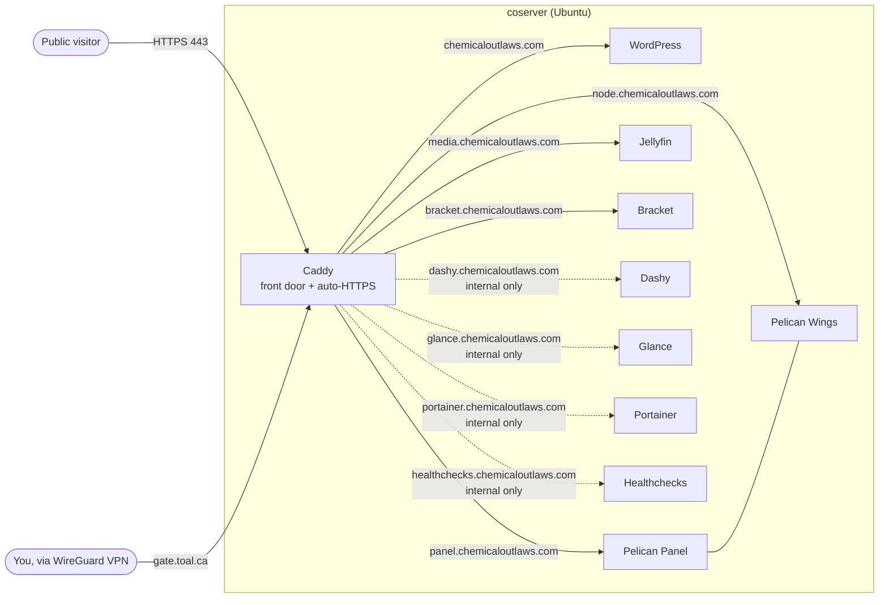
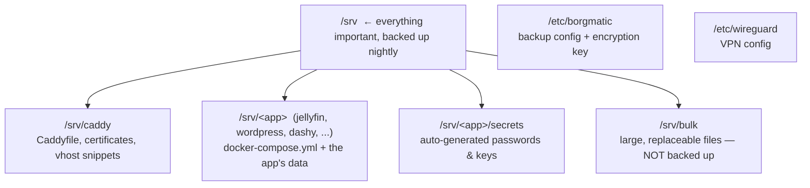
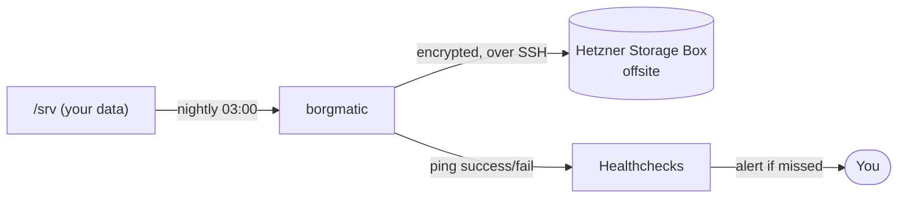

# Your Server: Owner's Operating Guide

This guide makes you the operator of your own server. It explains what is
running, how it fits together, how to run it day to day, and — if you ever stop
using the automation — how to manage everything by hand. You do not need anyone
else to keep this server running.

Two ways to manage this server are described throughout:

- **The automated way** — re-run the Ansible "recipe". Best when you want a
  change made consistently and recorded.
- **The manual way** — type commands directly on the server. Best for quick
  fixes, learning how things work, or if you decide to retire the automation
  entirely (see Section 11).

Both are first-class. The automation only *built* the server; nothing depends on
it to keep *running*. Everything uses standard Ubuntu tools (Docker, systemd,
WireGuard, borgmatic) that you can drive yourself.

---

## 1. The short version

Your server is one Ubuntu machine running several self-contained web
applications. Each app runs in its own **container** (an isolated box holding
just that app and its dependencies). A single web "front door" called **Caddy**
receives all web traffic, automatically obtains and renews HTTPS certificates,
and forwards each web address to the correct app.

The server also backs itself up offsite every night, watches itself for
failures, patches itself, and is firewalled against the internet.

All your data lives in one place: **`/srv`**. Back that up and you've backed up
everything.

### This server at a glance

| | |
|---|---|
| **Server name** | `coserver` |
| **Your domain** | `chemicaloutlaws.com` |
| **Admin user accounts** | `<user>`, `final` (these can edit app files over SFTP) |
| **How the automation connects** | It runs **locally on `coserver` itself** as `root` (`connection: local`) — you run the playbook on the server, not from another machine. |
| **Offsite backups** | Hetzner Storage Box `u483449-sub3.your-storagebox.de`, nightly at 03:00 |
| **Private network (VPN)** | This server is `192.168.129.2`, tunnelling to gateway `gate.toal.ca:51821` |

---

## 2. How it all fits together

### Traffic flow



Solid lines are **public** (anyone on the internet can reach them). The dotted
**internal only** sites (Dashy, Glance, Portainer, Healthchecks) return "403
Access denied" unless the visitor comes from your private network — currently
`192.168.0.0/16` or the single address `152.86.19.239`. All containers talk to
each other on a private Docker network called `web`.

### Where things live on disk



---

## 3. What is running (the full inventory)

### Apps you and your users visit

| Application | Purpose | Web address | Public? | Data folder |
|---|---|---|---|---|
| **WordPress** | Website / blog (your main site) | `chemicaloutlaws.com` | Public | `/srv/wordpress` |
| **Pelican Panel** | Control panel for game servers (Minecraft, etc.) | `panel.chemicaloutlaws.com` | Public | `/srv/pelican` |
| **Pelican Wings** | The engine that runs game servers (managed from the Panel) | `node.chemicaloutlaws.com` | Public | `/etc/pelican`, `/srv/gameservers` |
| **Jellyfin** | Private media streaming (movies, TV, music) | `media.chemicaloutlaws.com` | Public | `/srv/jellyfin` (media in `/srv/bulk`) |
| **Bracket** | Tournament-bracket system | `bracket.chemicaloutlaws.com` | Public | `/srv/bracket` |
| **Dashy** | Customisable links/tiles dashboard | `dashy.chemicaloutlaws.com` | Internal only | `/srv/dashy` |
| **Glance** | Lightweight info dashboard (feeds, widgets) | `glance.chemicaloutlaws.com` | Internal only | `/srv/glance` |

> **This server runs Pelican.** [Pelican](https://pelican.dev/) is the modern
> successor to Pterodactyl and runs as a single, simpler container (SQLite by
> default — no separate database or Redis), so there is no `pelican-database` or
> `pelican-cache` helper container.
>
> **Optional alternative — Pterodactyl Panel.** The older `sage.final.pterodactyl_panel`
> role still ships with this project but is **not currently deployed** (its
> inventory group is commented out). The two panels are *drop-in replacements*
> for each other, not an addition: you run one or the other, never both on the
> same host. See Section 10 for how to switch, and the roles' READMEs under
> `collections/ansible_collections/sage/final/roles/` for details.

> **Optional — dedicated game-server database (MySQL).** By default the Pelican
> panel uses its own embedded SQLite, and individual game servers only get a
> database if you give them one. The `sage.final.mysql` role adds a dedicated
> **MariaDB (MySQL)** container to act as the panel's *Database Host*: once
> configured, the panel creates a fresh database per game server on demand (many
> games — Minecraft plugins, etc. — need one). It ships with **Adminer**, a
> lightweight web tool for browsing and editing those databases. This role is
> **available but not deployed** until a host is placed in the `mysql` inventory
> group (Section 10). Its data lives in `/srv/mysql`, and the panel connects to
> it as the `panel` user (password in `/srv/mysql/secrets/panel_password`). See
> Section 3a and the role's README for setup.

> **Optional — media automation behind a VPN (Sonarr + Radarr + Surfshark).**
> Three more roles add a media-grabbing stack whose internet traffic is forced
> through a **Surfshark VPN**: `sage.final.surfshark` runs the VPN gateway, and
> `sage.final.sonarr` (TV) / `sage.final.radarr` (movies) run *inside* the VPN
> container's network so they have **no way to reach the internet except through
> the tunnel** (if the VPN drops, their traffic stops — a built-in kill switch).
> `sage.final.seerr` adds a friendly request/discovery frontend on top. These are
> **available but not deployed** until hosts are placed in the `surfshark`,
> `sonarr`, `radarr`, and `seerr` inventory groups. Data lives in
> `/srv/surfshark`, `/srv/sonarr`, `/srv/radarr`, `/srv/seerr`; media lands in
> `/srv/bulk` (not backed up). See Section 3b and the roles' READMEs for setup.

### Behind-the-scenes services

| Component | Purpose | How to reach it |
|---|---|---|
| **Caddy** | Web front door; auto-HTTPS; routes addresses to apps | `/srv/caddy` |
| **Healthchecks** | Alerts you when a scheduled job (e.g. backup) fails to check in | `healthchecks.chemicaloutlaws.com` (internal only) |
| **Borg / Borgmatic** | Encrypted nightly offsite backup of `/srv` to Hetzner | runs from a systemd timer |
| **Cockpit** | Web dashboard for the **machine** (CPU, RAM, disks, logs, updates) | `https://coserver:9090` (or the server's LAN IP) |
| **Portainer** | Web dashboard for the **containers** (restart, logs, terminal) | `portainer.chemicaloutlaws.com` (internal only) |
| **Hardening** | SSH lock-down, fail2ban, kernel hardening, automatic security patches | system-wide |
| **WireGuard** | Encrypted VPN tunnel to your private network (gateway `gate.toal.ca`) | `/etc/wireguard/wg0.conf` |

> The folders `disk_os`, `disk_pool`, `disk_stripe`, and `run` in the project are
> empty placeholders that set up nothing. Ignore them.

### 3a. The optional game-server database host (MySQL + Adminer)

This is an **add-on**, deployed only when a host is in the `mysql` inventory
group. It gives the game panel a real database server so each game server can be
handed its own database.

| Container | Purpose | Where |
|---|---|---|
| **`mysql`** | MariaDB (MySQL) database server — the panel's "Database Host" | `/srv/mysql/data`, port `3306` published on the host |
| **`mysql-adminer`** | Adminer — web UI to browse/edit databases (modern phpMyAdmin) | fronted by Caddy, e.g. `db.chemicaloutlaws.com` (set it internal-only) |

How it works:

- The database listens on the host's port **3306** so game servers — including
  ones running on other Wings nodes — can connect to the databases they're
  given. Pin `mysql_published_address` to a private/WireGuard address to keep it
  off the public internet.
- The role creates one management account, **`panel`**, with full privileges.
  You register it once in the panel under **Admin → Databases → Create New**
  (Host = the server's address, Port = 3306, Username = `panel`, Password =
  contents of `/srv/mysql/secrets/panel_password`). After that the panel creates
  a database and a scoped user for each game server automatically.
- **Adminer** is the graphical tool for poking at those databases directly. Log
  in with server `mysql` and either the `panel` user or `root` (passwords under
  `/srv/mysql/secrets/`). It's published only through Caddy — declare a
  `caddy_sites` entry pointing at `mysql-adminer:8080` and mark it
  `internal_only: true`, since it can reach every database.

Deploy or update it with the `mysql` tag (Section 10). Its data and secrets live
under `/srv/mysql`, so the nightly backup covers it like every other app.

### 3b. The optional media stack behind a VPN (Sonarr + Radarr + Surfshark)

This is an **add-on**, deployed only when hosts are in the `surfshark`, `sonarr`,
`radarr`, and `seerr` inventory groups. It runs the popular "*arr*" media
automation apps with all their traffic forced through a Surfshark VPN, plus a
request frontend.

| Container | Purpose | Where |
|---|---|---|
| **`surfshark`** | VPN gateway (kill switch + DNS); the others route through it | `/srv/surfshark` |
| **`sonarr`** | Watches for and organises **TV** episodes | `/srv/sonarr`, library in `/srv/bulk/media/tv` |
| **`radarr`** | Watches for and organises **movies** | `/srv/radarr`, library in `/srv/bulk/media/movies` |
| **`seerr`** | Request & discovery frontend — users ask for movies/TV here | `/srv/seerr` |

[Seerr](https://seerr.dev/) (the unified successor to Overseerr/Jellyseerr) is
the friendly front page of this stack: people sign in with their Jellyfin
account, browse, and click "Request". Seerr passes the request to Radarr/Sonarr
to fetch, and it shows up in Jellyfin when ready. Unlike Sonarr/Radarr, Seerr is
**not** behind the VPN by default — it's a frontend that needs to be reachable
and only talks to Jellyfin and a metadata service. Caddy points straight at
`seerr:5055`:

```yaml
caddy_sites:
  - { fqdn: "requests.chemicaloutlaws.com", upstream: "seerr:5055" }
```

(You *can* route Seerr through the VPN too by setting `seerr_vpn_container:
surfshark`, but it isn't necessary.)

How the VPN enforcement works (the important part):

- `sonarr` and `radarr` are started with their network **provided by the
  `surfshark` container** (Docker's `network_mode: "container:surfshark"`). They
  have no network card of their own, so the *only* way out is the VPN tunnel. If
  the VPN container is down, they have no internet at all — they cannot leak your
  real IP. This is the whole point of the design.
- Because their network belongs to the VPN container, **their web pages are
  served through it**: Caddy points at `surfshark:8989` (Sonarr) and
  `surfshark:7878` (Radarr), not at the app names. Set these up in `caddy_sites`
  and mark them `internal_only: true`:

  ```yaml
  caddy_sites:
    - { fqdn: "sonarr.chemicaloutlaws.com", upstream: "surfshark:8989", internal_only: true }
    - { fqdn: "radarr.chemicaloutlaws.com", upstream: "surfshark:7878", internal_only: true }
  ```

- **Surfshark credentials** are required. Put your Surfshark *service*
  credentials (from the Surfshark dashboard → Manual setup, **not** your normal
  login) into inventory as `surfshark_openvpn_user` / `surfshark_openvpn_password`,
  encrypted with Ansible Vault.

Two operational gotchas worth knowing:

- **Order matters.** The VPN must be up before the apps. The playbook deploys
  them in the right order (`surfshark` → `sonarr` → `radarr`).
- **Recreating the VPN breaks the apps' network.** If the `surfshark` container
  is replaced (e.g. an image update), Sonarr/Radarr lose their network and get
  stuck restarting. Fix it by re-running their tags (`--tags sonarr,radarr`) —
  the roles detect this and re-attach them — or manually:
  `cd /srv/sonarr && sudo docker compose up -d --force-recreate`.

To check the VPN is actually working:

```bash
sudo docker exec surfshark wget -qO- https://ipinfo.io/ip   # should show a Surfshark IP, not yours
```

Deploy or update with the `surfshark`, `sonarr`, `radarr`, and `seerr` tags
(Section 10).

---

## 4. Five concepts that explain everything

**1. Containers (Docker).** Every app runs in its own Docker container. Each
app's container is defined by a `docker-compose.yml` file in its `/srv/<app>`
folder. You start, stop, update, and inspect apps with `docker` and
`docker compose` commands — covered in Section 6.

**2. Caddy, the front door.** Only Caddy is exposed to the web (ports 80/443).
It reads `/srv/caddy/Caddyfile`, which lists every web address and which app it
points to, and it gets HTTPS certificates automatically. Nothing to renew by
hand.

**3. `/srv` is your data.** Configuration, databases, and content all live under
`/srv/<app>`. This is exactly what the nightly backup protects. `/srv/bulk` is
deliberately excluded (meant for large, replaceable files).

**4. Secrets are generated and saved for you.** On first install, each app's
database passwords and keys are generated and written to `/srv/<app>/secrets/`.
You can read them there with `sudo cat`. Secrets you provide (like the backup
passphrase) are stored encrypted in the project with **Ansible Vault**.

**5. Everything runs on standard Ubuntu services.** Containers are kept alive by
Docker (`restart: always`), backups by a systemd timer, the VPN by WireGuard.
None of this needs Ansible once it's set up — so you can run the server
indefinitely by hand if you choose (Section 11).

---

## 5. Getting in: the management dashboards

You rarely need the command line. Two web dashboards cover most tasks:

- **Cockpit — the machine.** Open `https://coserver:9090` (or the server's LAN
  IP, e.g. `https://192.168.129.2:9090`), sign in with your normal server login.
  See disk space, memory, running services, system logs, and apply OS updates
  with a click. It also has a built-in **Terminal** and **File browser** if you
  want them.

- **Portainer — the apps.** Open `https://portainer.chemicaloutlaws.com` from
  your private network or over the WireGuard VPN (it's internal-only). On first
  visit, create the admin account and accept the "local" environment. Use it to
  restart an app, read its logs, open a shell inside a container, or check
  resource usage. Your Ansible-deployed stacks show up as **Limited** — that's
  expected; Portainer can still manage their containers.

---

## 6. Day-to-day app management (the manual way)

Every app is a `docker compose` stack living in `/srv/<app>`. The same handful
of commands works for all of them. Run them as a user with `sudo`, or as root.

```bash
# Go to the app's folder first
cd /srv/jellyfin            # or wordpress, dashy, glance, bracket, caddy, ...

# See what's running
sudo docker compose ps

# Start (or re-create after a config change)
sudo docker compose up -d

# Stop
sudo docker compose down

# Restart just this app
sudo docker compose restart

# Watch the logs live (Ctrl-C to stop)
sudo docker compose logs -f

# Update to the latest version: pull new images, then recreate
sudo docker compose pull && sudo docker compose up -d
```

Single-container shortcuts (handy in a pinch):

```bash
sudo docker ps                      # list ALL running containers on the host
sudo docker restart jellyfin        # restart one container by name
sudo docker logs -f wordpress       # tail one container's logs
sudo docker exec -it wordpress bash # open a shell inside a container
```

**Editing an app's configuration.** Edit the files under `/srv/<app>` (for
example `/srv/dashy/user-data/conf.yml` or `/srv/glance/config/glance.yml`),
then `cd` into the folder and run `sudo docker compose restart`. You can edit
these files directly on the server, through Cockpit's file browser, or over SFTP
if your login is a member of that app's group (e.g. the `dashy` group).

**Finding an app's passwords.** They're saved on the server:

```bash
sudo ls /srv/wordpress/secrets/
sudo cat /srv/wordpress/secrets/db_password
```

---

## 7. The web front door: Caddy

Caddy decides which web address goes to which app, and handles all HTTPS.

**To add or change a website address**, edit `/srv/caddy/Caddyfile`. Each app is
a block like this:

```caddyfile
media.chemicaloutlaws.com {
    encode gzip
    reverse_proxy jellyfin:8096
}
```

To make a site **internal only** (reachable only from your private network), add
`import internal_only` inside its block — this is how Dashy, Glance, Portainer,
and Healthchecks are set up. "Internal" is defined by the `caddy_internal_cidrs` list (currently
`192.168.0.0/16` and `152.86.19.239/32`); any visitor outside those ranges gets
a 403.

**After editing the Caddyfile, reload Caddy without downtime:**

```bash
sudo docker exec caddy caddy reload --config /etc/caddy/Caddyfile
```

Caddy fetches a certificate for any new address automatically, as long as:
- a DNS record for that name points at your server's public IP, **and**
- ports 80 and 443 are reachable from the internet.

> The automated way to do the same thing is to add an entry to the `caddy_sites`
> list in the project's `inventory/` and re-run `--tags caddy` (Section 10).

---

## 8. Backups and restore

This is the most important section. Read it once now, not during an emergency.

**What happens automatically:**
- Every night around **03:00**, `borgmatic` makes an encrypted backup of `/srv`
  (excluding `/srv/bulk`) and uploads it to your offsite Hetzner Storage Box
  (`u483449-sub3.your-storagebox.de`).
- It keeps **30 daily, 12 monthly, 10 yearly** snapshots and prunes the rest.
- Each run pings **Healthchecks** (a ping URL is already configured), which
  alerts you if a backup is ever missed.

> **What is NOT backed up:** `/srv/bulk` is deliberately excluded — and your
> **Jellyfin media library lives in `/srv/bulk`**. So your movies/TV/music are
> *not* in the nightly backup (sensible: it's large and usually replaceable).
> Jellyfin's *settings* under `/srv/jellyfin` **are** backed up. If your media is
> irreplaceable, arrange a separate copy of `/srv/bulk`.

**The one thing you must protect:** the backup **passphrase** (and the offsite
storage login). If the passphrase is lost, *no one* — including you — can ever
read the backups again. There is no reset. Keep it in a password manager and,
ideally, on paper in a safe, stored separately from the server.

**Driving backups by hand** (config lives at `/etc/borgmatic/config.yaml`):

```bash
# Run a backup right now
sudo borgmatic

# See when the automatic backup last ran / runs next
systemctl list-timers borgmatic.timer

# List all backup snapshots in the repository
sudo borgmatic list

# Show stats about the repository / a snapshot
sudo borgmatic info
```

**Restoring files** (the part that matters):

```bash
# 1. Find the snapshot you want
sudo borgmatic list

# 2. Restore that whole snapshot into the current directory
#    (do this in an empty folder, then copy what you need back into /srv)
sudo borgmatic extract --archive <snapshot-name>

# Example: restore just /srv/wordpress from a snapshot
sudo borgmatic extract --archive <snapshot-name> --path srv/wordpress
```

After restoring an app's folder, `cd /srv/<app>` and run
`sudo docker compose up -d` to bring it back online.



---

## 9. Security: what's on, what's off, what to fix

### Already active

**Intrusion blocking (fail2ban).** Automatically bans IPs that repeatedly fail
SSH logins.

```bash
sudo fail2ban-client status                 # list active jails
sudo fail2ban-client status sshd            # see current bans
sudo fail2ban-client set sshd unbanip <IP>  # lift a ban
```

Only the `sshd` jail is active by default. The hardening role can also install
**custom filters and jails** for services fail2ban ships no filter for — set
`hardening_fail2ban_filters` and `hardening_fail2ban_extra_jails` in inventory,
then re-run `--tags hardening`. The worked example in the role's
`defaults/main.yml` bans scanners hitting **Pelican Wings' SFTP** (journald unit
`wings.service`, port 2022) after 3 failures.

**SSH lock-down.** Login is key-based only (no passwords). Settings live in the
drop-in file `/etc/ssh/sshd_config.d/99-hardening.conf`. After editing it,
`sudo systemctl reload ssh`.

**Kernel hardening** (sysctl) is applied via `/etc/sysctl.d/99-hardening.conf`.

**Automatic security patches** are active (Ubuntu's `unattended-upgrades`). You
can also patch on demand with `sudo apt update && sudo apt upgrade`.

**WireGuard VPN.** Connects this server (`192.168.129.2`) to your private network
through the gateway `gate.toal.ca:51821`, so internal-only sites stay private.

```bash
sudo wg show                              # is the tunnel up?
sudo systemctl restart wg-quick@wg0       # restart the tunnel
```

> The host firewall (UFW) is intentionally left off — perimeter filtering is
> handled by the upstream gateway, so the host doesn't run its own firewall.

### Recommended housekeeping

**Rotate the Healthchecks admin password.** The Healthchecks superuser
(`admin@chemicaloutlaws.com`) was bootstrapped with a weak password stored in
plain text in the inventory. Change it in the Healthchecks web UI, and replace
the inventory value with an `ansible-vault`-encrypted one.

---

## 10. The automated way (re-running the recipe)

The whole server is described in the Ansible playbook `site.yml`. Re-running it
is safe — it only changes what no longer matches the description. This is the
tidy way to make a change *and* keep it recorded.

In this setup Ansible is configured to run **on `coserver` itself**
(`connection: local`), so you run these commands while logged in to the server,
from the project checkout.

```bash
# Re-apply everything
ansible-navigator run site.yml --eei ee-demo -i inventory/hosts.yml

# Re-apply just one piece (tags):
ansible-navigator run site.yml --tags jellyfin
ansible-navigator run site.yml --tags caddy
ansible-navigator run site.yml --tags borg
ansible-navigator run site.yml --tags hardening
```

Available tags: `update`, `hardening`, `wireguard_client`, `cockpit`, `caddy`,
`pelican`, `pelican_wings`, `pterodactyl`, `wings`, `mysql`, `surfshark`,
`sonarr`, `radarr`, `seerr`, `wordpress`, `dashy`, `glance`, `bracket`,
`jellyfin`, `portainer`, `healthchecks`, `borg`. Add `--skip-tags update` to skip
the OS upgrade. The `mysql` play (the optional game-server database host, Section
3a) and the `surfshark` / `sonarr` / `radarr` / `seerr` plays (the optional media
stack, Section 3b) are dormant — they do nothing unless a host is placed in their
groups. This server runs **Pelican** (tags
`pelican` and `pelican_wings`); the `pterodactyl` / `wings` plays are dormant —
they do nothing unless a host is placed in the `pterodactyl_panel` /
`pterodactyl_wings` groups.

**Where to change settings:** the `inventory/` folder holds per-server settings
(web addresses, options, and Vault-encrypted secrets). Adding a public address
means adding to the `caddy_sites` list there.

### Switching the game panel between Pelican and Pterodactyl

This server currently runs **Pelican**. The two panels can't run on the same
host, and there's no in-place data conversion — switching is a migration, so do
it only when you can recreate your servers in the other panel. To switch back to
Pterodactyl:

1. In inventory, uncomment the `pterodactyl_panel` (and `pterodactyl_wings`)
   group and remove `coserver` from the `pelican_panel` / `pelican_wings` groups.
2. Set `pterodactyl_panel_fqdn` and the panel's other required vars in
   `inventory/group_vars/`.
3. Repoint the panel's `caddy_sites` upstream from `pelican-panel:80` to
   `pterodactyl-panel:80`.
4. Run `ansible-navigator run site.yml --tags pterodactyl,wings,caddy`.
5. Finish setup in the Pterodactyl installer in a browser.

Pelican's data stays untouched under `/srv/pelican`, so you can fall back by
reversing the inventory and Caddy changes. (Going the other direction —
Pterodactyl → Pelican — is the same process with the groups swapped; Pelican
finishes setup at `https://panel.chemicaloutlaws.com/installer`, SQLite by
default.)

> **Important:** if you make changes *by hand* on the server (Sections 6–9) and
> later re-run a matching playbook tag, the playbook may overwrite your manual
> change to match what's in `inventory/`. Pick one source of truth per app, or
> mirror manual changes back into `inventory/`. If you decide to stop using the
> playbooks entirely, see the next section.

---

## 11. Going fully manual (retiring the automation)

You are not locked in. The server runs entirely on standard Ubuntu components;
Ansible was only the installer. To operate without it forever:

1. **Keep the data and configs in place.** Everything you need already lives on
   the server: app stacks in `/srv/<app>/docker-compose.yml`, the web config in
   `/srv/caddy/Caddyfile`, backups in `/etc/borgmatic/config.yaml`, the VPN in
   `/etc/wireguard/`. Nothing here references Ansible.

2. **Save the secrets out of the project.** Before walking away from the
   playbooks, copy these somewhere safe:
   - the **backup passphrase** (from your Vault / inventory),
   - the **Hetzner Storage Box** login and SSH key (`/etc/borgmatic/`),
   - any app admin passwords you set, plus what's in each
     `/srv/<app>/secrets/`.

3. **Containers already survive reboots.** The stacks use `restart: always`, and
   `docker.service` is **enabled and active** on this server, so apps
   come back automatically after a reboot — no Ansible needed. Confirm any time
   with:

   ```bash
   systemctl is-enabled docker.service   # -> enabled
   sudo docker ps                                 # all stacks running
   ```

   (If a stack is ever down after a reboot, just
   `cd /srv/<app> && sudo docker compose up -d`.)

4. **From then on, manage each app directly** with the commands in Sections 6–9:
   - change an app → edit files under `/srv/<app>`, then `docker compose up -d`
   - add a website → edit `/srv/caddy/Caddyfile`, then reload Caddy
   - update an app → `docker compose pull && docker compose up -d`
   - backups, fail2ban, VPN → the commands already shown

5. **Optional:** you can delete the Ansible project from your workstation. It
   does not run on the server and removing it changes nothing there. (Keep a
   copy if you might want the recorded settings later.)

That's it — at that point the server is a plain, well-organised Ubuntu host that
you fully control by hand.

---

## 12. Troubleshooting

| Symptom | What to do |
|---|---|
| An app's page won't load | `sudo docker ps` — is its container running? If not, `cd /srv/<app> && sudo docker compose up -d`. Then check Caddy is up (it serves every site): `sudo docker ps \| grep caddy`. |
| App is running but errors | `cd /srv/<app> && sudo docker compose logs -f` and read the recent lines. |
| HTTPS certificate warning | Confirm the DNS name points at the server and ports 80/443 are open to the internet, then reload Caddy: `sudo docker exec caddy caddy reload --config /etc/caddy/Caddyfile`. Check Caddy's logs for the ACME error. |
| Backup alert from Healthchecks | Run `sudo borgmatic` manually and read the output; confirm the Hetzner box is reachable. Check `systemctl status borgmatic.service`. |
| Can't reach Dashy, Glance, Portainer, or Healthchecks | They're internal-only on purpose — reach them from your private network (`192.168.0.0/16`) or over the WireGuard VPN. Confirm the tunnel with `sudo wg show`. |
| Locked out / blocked by fail2ban | From an allowed network: `sudo fail2ban-client set sshd unbanip <your-IP>`. |
| Whole server unreachable | Use your hosting provider's console to confirm it's powered on; check Cockpit at `:9090`. |
| Server low on disk | In Cockpit, or `df -h`. Old container images can be cleared with `sudo docker image prune`. Remember `/srv/bulk` is not backed up — safe place for large temporary files. |

---

## 13. Glossary

- **Ansible** — the automation that originally built the server from code.
- **Playbook (`site.yml`)** — the instructions Ansible runs.
- **Container / Docker** — an isolated package that runs one app; managed with
  `docker` / `docker compose`.
- **`docker-compose.yml`** — the file describing one app's container(s); one per
  app under `/srv/<app>`.
- **Caddy** — the web server that handles HTTPS and routes addresses to apps.
- **Reverse proxy** — what Caddy does: public address in, correct app out.
- **`/srv`** — where all app data lives and what gets backed up.
- **Secrets** — passwords/keys, generated into `/srv/<app>/secrets/` and (for
  ones you supply) encrypted with **Ansible Vault**.
- **Borg / Borgmatic** — the encrypted offsite backup system.
- **Healthchecks** — alerts you when a scheduled job fails to check in.
- **fail2ban** — the automatic intruder-blocker (bans repeated failed logins).
- **WireGuard** — the encrypted VPN tunnel to your private network.
- **systemd timer** — Ubuntu's scheduler; runs the nightly backup.
- **DNS record** — the setting at your domain registrar that points a web
  address at your server's IP.

---

*For the exact settings of any single component, see its folder under
`collections/ansible_collections/sage/final/roles/<name>/` — each has a
`README.md` and a `defaults/main.yml` listing every option.*
